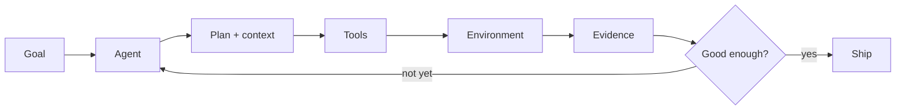

<div align="center">

# Yuxi Zhu

### I build AI systems with somewhere to go and something to do.

<samp>AI Agent Developer · AI Application Engineer</samp>

<br />

`plan` → `use tools` → `touch the real world` → `evaluate` → `try again`

</div>

---

Models are interesting. Systems that can **plan, survive failure, and prove what they did** are more interesting.

I work on agent runtimes, evaluated RAG, and the infrastructure that turns a promising model response into a result you can inspect.

## Selected systems

<table>
  <tr>
    <td colspan="2">
      <h3><a href="https://github.com/JackZhu001/Oh-My-Claw">Oh-My-Claw</a> — an agent runtime that finishes the job</h3>
      <p>Tool calling, context compression, repository retrieval, persistent sessions, loop protection, and a <code>lead → researcher → builder → reviewer</code> workflow.</p>
      <p><code>Goal → Plan → Tool → Result → Evidence</code></p>
      <sub>Python · Function calling · Multi-agent workflows · RepoRAG · Observability</sub>
    </td>
  </tr>
  <tr>
    <td width="50%" valign="top">
      <h3><a href="https://github.com/JackZhu001/Agentic-RAG-DocMind">DocMind</a></h3>
      <p>An evaluation-driven RAG system with three-route retrieval, BGE reranking, confidence-aware answers, and ablation studies.</p>
      <p><code>retrieve → rerank → verify</code></p>
      <sub>Python · Qdrant · BGE-M3 · PyTorch</sub>
    </td>
    <td width="50%" valign="top">
      <h3><a href="https://github.com/JackZhu001/zhupeigen-codex-pet">zhupeigen-codex-pet</a></h3>
      <p>A cheerful pink desktop companion for Codex—because developer experience can be technically sound and slightly ridiculous.</p>
      <p><code>art → atlas → runtime → tiny coworker</code></p>
      <sub>Codex · Shell · Spritesheets</sub>
    </td>
  </tr>
</table>

## The loop



The model is one component. The loop is the product.

## Working set

```text
agent runtimes     tool use · orchestration · persistence · observability
evaluated AI       RAG · reranking · retrieval metrics · ablation studies
engineering        Python · TypeScript · React · Docker · Git
ML / retrieval     PyTorch · Transformers · Qdrant · BM25 · BGE
```

## Contribution snake

<picture>
  <source media="(prefers-color-scheme: dark)" srcset="https://raw.githubusercontent.com/JackZhu001/JackZhu001/output/github-contribution-grid-snake-dark.svg" />
  <source media="(prefers-color-scheme: light)" srcset="https://raw.githubusercontent.com/JackZhu001/JackZhu001/output/github-contribution-grid-snake.svg" />
  
</picture>

<div align="center">
  <samp>Agent says “done” → ask for evidence.</samp>
  <br /><br />
  <a href="https://github.com/JackZhu001?tab=repositories">Explore the systems</a> ·
  <a href="https://github.com/JackZhu001/JackZhu001/issues">Start a conversation</a>
</div>
