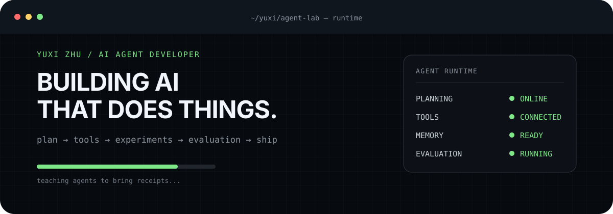
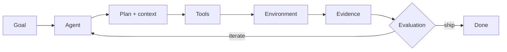

<p align="center">
  
</p>

<p align="center">
  <strong>AI Agent Developer · AI Application Engineer</strong><br />
  I build AI systems that don't just answer questions — they plan, use tools, run experiments, and get things done.
</p>

<p align="center">
  <a href="#-systems">Systems</a> ·
  <a href="#-the-loop">The loop</a> ·
  <a href="#-toolkit">Toolkit</a> ·
  <a href="#-connect">Connect</a>
</p>

---

## `./what-i-build`

| | |
|---|---|
| **Agent runtimes** | Long-running systems that plan, call tools, coordinate work, and leave evidence behind. |
| **Evaluated AI** | Retrieval and generation pipelines measured with real test sets, metrics, and ablations. |
| **Developer tools** | AI applications designed around the work, not around a chat box. |

## `./systems`

### 01 / [Oh-My-Claw](https://github.com/JackZhu001/Oh-My-Claw)

**An engineering agent runtime built to finish the job.** It combines native tool calling, context compression, repository retrieval, loop protection, persistent sessions, and a `lead → researcher → builder → reviewer` team workflow.

`Goal → Plan → Tool → Result → Evidence`

<sub>Python · Function calling · Multi-agent workflows · RepoRAG · Observability</sub>

### 02 / [Agentic-RAG-DocMind](https://github.com/JackZhu001/Agentic-RAG-DocMind)

**A RAG system that treats retrieval quality as an engineering problem.** Three retrieval routes—HyDE, query rewriting, and BM25—feed BGE reranking and confidence-aware generation, backed by retrieval metrics and ablation studies.

`Query → Hybrid retrieval → Rerank → Confidence gate → Answer + sources`

<sub>Python · Qdrant · BGE-M3 · PyTorch · Evaluation</sub>

### 03 / [zhupeigen-codex-pet](https://github.com/JackZhu001/zhupeigen-codex-pet)

**A cheerful pink desktop companion for Codex.** A small experiment in making developer tools feel more alive, packaged as a lightweight animated pet with a reproducible install path.

`Character art → Animation atlas → Pet runtime → Better desk energy`

<sub>Codex · Shell · Spritesheets · Developer experience</sub>

## `./the-loop`

I care about the full execution loop—the part after the model produces a plausible sentence.



## `~/currently-building`

- **Durable agent workflows** — keeping long tasks grounded with retrieval, state, traces, and review.
- **Evaluation-first RAG** — measuring retrieval and generation instead of trusting the demo.
- **Human developer tools** — serious engineering with room for a pink pig in the runtime.

## `./toolkit`

```text
AI systems       LLMs · agents · function calling · RAG · reranking · evaluation
Engineering      Python · TypeScript · React · Docker · Git
Agent runtime    orchestration · sandboxing · persistence · observability
ML / retrieval   PyTorch · Transformers · Qdrant · BM25 · BGE
```

## `tail -f agent.log`

```text
[09:41] goal accepted
[09:42] tools called; assumptions downgraded to evidence
[09:43] agent reported "done"
[09:44] evaluation requested a second opinion
[09:45] shipped anyway — this time with receipts
```

## `> connect`

Interested in agents, evaluated AI applications, or useful experiments with LLMs?

[Explore the repositories](https://github.com/JackZhu001?tab=repositories) · [Open a conversation](https://github.com/JackZhu001/JackZhu001/issues)
